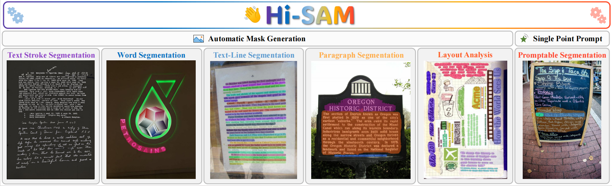
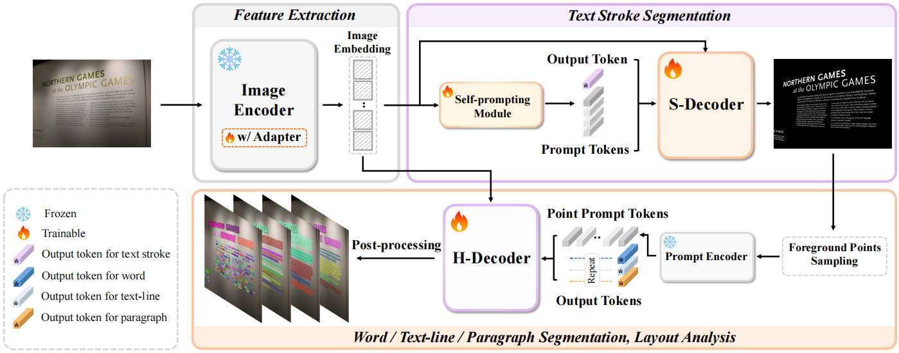
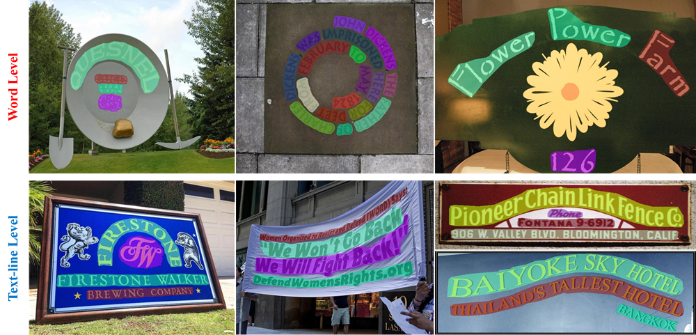

<h1 align="center">Hi-SAM: Marrying Segment Anything Model for Hierarchical Text Segmentation</h1> 

<p align="center">
<a href="https://paperswithcode.com/sota/hierarchical-text-segmentation-on-hiertext?p=hi-sam-marrying-segment-anything-model-for"></a>
<a href="https://arxiv.org/abs/2401.17904"></a>
<a></a>
</p>

> [Hi-SAM: Marrying Segment Anything Model for Hierarchical Text Segmentation](https://arxiv.org/abs/2401.17904).
>
>  [arXiv preprint]

This is the official repository for Hi-SAM, a unified hierarchical text segmentation model. Refer to our paper for more details.

## :sparkles: Highlight



- **Hierarchical Text Segmentation.** Hi-SAM unifies text segmentation across stroke, word, text-line, and paragraph levels. Hi-SAM also achieves layout analysis as a by-product.

- **Automatic and Interactive.** Hi-SAM supports both automatic mask generation and interactive promptable mode. Given a single-point prompt, Hi-SAM provides word, text-line, and paragraph masks.

- **High-Quality Text Stroke Segmentation & Stroke Labeling Assistant.** High-quality text stroke segmentation by introducing mask feature of 1024×1024 resolution with minimal modification in SAM's original mask decoder. Our contributed stroke level annotations for [HierText](https://github.com/google-research-datasets/hiertext) can be downloaded following [data_preparation.md](datasets/data_preparation.md). Some examples are displayed here:


## :bulb: Overview of Hi-SAM



## :fire: News
- **[`2024/02/23`]**: Inference and evaluation codes are released. Checkpoints are available. Some applications are provided.


## :hammer_and_wrench: Install

**Recommended**: `Linux` `Python 3.8` `Pytorch 1.10` `CUDA 11.1`

```
conda create --name hi_sam python=3.8 -y
conda activate hi_sam
pip install torch==1.10.0+cu111 torchvision==0.11.0+cu111 -f https://download.pytorch.org/whl/torch_stable.html
git clone https://github.com/ymy-k/Hi-SAM.git
cd Hi-SAM
pip install -r requirements.txt
```

## :pushpin: Checkpoints

You can download the following model weights and put them in `pretrained_checkpoint/`.

- **SAM-TSS (only for text stroke segmentation)**

|Model|Used Dataset|Weights|fgIOU|F-score|
|:------:|:------:|:------:|:------:|:------:|
|SAM-TSS-B|Total-Text|[OneDrive](https://1drv.ms/u/s!AimBgYV7JjTlgcoycYfJS3jn8Zi5aQ?e=qsGFu4)|80.93|86.25|
|SAM-TSS-L|Total-Text|[OneDrive](https://1drv.ms/u/s!AimBgYV7JjTlgco3-gIk1_LtCjaUZg?e=RgYfYu)|84.59|88.69|
|SAM-TSS-H|Total-Text|[OneDrive](https://1drv.ms/u/s!AimBgYV7JjTlgco0WBDWOp4Va6mS0w?e=QPvtGL)|84.86|89.68|

|Model|Used Dataset|Weights|fgIOU|F-score|
|:------:|:------:|:------:|:------:|:------:|
|SAM-TSS-B|TextSeg|[OneDrive](https://1drv.ms/u/s!AimBgYV7JjTlgcow1U3IUTVOZoQPgQ?e=XGmher)|87.15|92.81|
|SAM-TSS-L|TextSeg|[OneDrive](https://1drv.ms/u/s!AimBgYV7JjTlgco2ogP59MnXtR6bSw?e=5iq3Rt)|88.77|93.79|
|SAM-TSS-H|TextSeg|[OneDrive](https://1drv.ms/u/s!AimBgYV7JjTlgco1z9sdUi1vXCsKgA?e=U3WPJy)|88.96|93.87|

|Model|Used Dataset|Weights|fgIOU|F-score|
|:------:|:------:|:------:|:------:|:------:|
|SAM-TSS-B|HierText|[OneDrive](https://1drv.ms/u/s!AimBgYV7JjTlgcouDoj3oDJtpDKxtQ?e=teOm4L)|73.39|81.34|
|SAM-TSS-L|HierText|[OneDrive](https://1drv.ms/u/s!AimBgYV7JjTlgco4WC_2I3pMGOCcKg?e=y4XcNi)|78.37|84.99|
|SAM-TSS-H|HierText|[OneDrive](https://1drv.ms/u/s!AimBgYV7JjTlgcozVtoOKCQL_HCmsQ?e=fI6e1o)|79.27|85.63|

- **Hi-SAM** 

|Model|Used Dataset|Weights|Stroke F-score|Word F-score|Text-Line F-score|Paragraph F-score|
|:------:|:------:|:------:|:------:|:------:|:------:|:------:|
|Hi-SAM-B|HierText|[OneDrive](https://1drv.ms/u/s!AimBgYV7JjTlgcosk3ZK1dImhxaW9g?e=xTsegH)|79.78|78.34|82.15|71.15|
|Hi-SAM-L|HierText|[OneDrive](https://1drv.ms/u/s!AimBgYV7JjTlgcovMjJKfH6baFBTGw?e=T3IrUf)|82.90|81.83|84.85|74.49|
|Hi-SAM-H|HierText|[OneDrive](https://1drv.ms/u/s!AimBgYV7JjTlgcoxoNjp1IG7xitzrg?e=0z4QhJ)|83.36|82.86|85.30|75.97|

The results of Hi-SAM on the test set are reported here.

:star: **`Note`:** For faster downloading and saving storage, **above checkpoints do not contain the parameters in SAM's ViT image encoder**. Please follow [segment-anything](https://github.com/facebookresearch/segment-anything) to achieve `sam_vit_b_01ec64.pth`, `sam_vit_l_0b3195.pth`, `sam_vit_h_4b8939.pth` and put them in `pretrained_checkpoint/` for loading the frozen parameters in ViT image encoder.

## :arrow_forward: Usage

### **1. Visualization Demo**

**1.1 Text stroke segmentation (for SAM-TSS & Hi-SAM):**

```
python demo_hisam.py --checkpoint pretrained_checkpoint/sam_tss_l_hiertext.pth --model-type vit_l --input demo/2e0cb33320757201.jpg --output demo/
```

- `--checkpoint`: the model path.
- `--model-type`: the backbone type. Use `vit_b` for ViT-Base backbone,  `vit_l` for ViT-Large,  `vit_h` for ViT-Huge. 
- `--input`: the input image path.
- `--output`: the output image path or folder.

To achieve better quality on small texts using sliding window, run the following script:

```
python demo_hisam.py --checkpoint pretrained_checkpoint/sam_tss_l_hiertext.pth --model-type vit_l --input demo/2e0cb33320757201.jpg --output demo/2e0cb33320757201_sliding.png --patch_mode
```

- `--patch_mode`: enabling sliding window inference. The default patch size is 512×512, the stride is 384 (for HierText). You can adjust the setting for better result on your data.

**1.2 Word, Text-line, and Paragraph Segmentation (for Hi-SAM)**

Run the following script for promptable segmentation on demo/img293.jpg:

```
python demo_hisam.py --checkpoint pretrained_checkpoint/hi_sam_l.pth --model-type vit_l --input demo/img293.jpg --output demo/ --hier_det
```

- `--hier_det`: enabling hierarchical segmentation. Hi-SAM predicts a word mask, a text-line mask, and a paragraph mask for each single-point prompt. See demo_hisam.py for the point position and details.

### **2. Evaluation**

Please follow [data_preparation.md](datasets/data_preparation.md) to prepare the datasets at first.

**2.1 Text Stroke Segmentation (for SAM-TSS & Hi-SAM)**

If you only want to evaluate the text stroke segmentation part performance, run the following script:

```
python -m torch.distributed.launch --nproc_per_node=8 train.py --checkpoint <saved_model_path> --model-type <select_vit_type> --val_datasets hiertext_test --eval
```

- `--nproc_per_node`: you can use multiple GPUs for faster evaluation.
- `--val_datasets`: the selected dataset for evaluation. Use `totaltext_test` for evaluation on the test set of Total-Text,  `textseg_test` for the test set of TextSeg,  `hiertext_test` for the test set of HierText.
-  `--eval`: use evaluation mode.

If you want to evaluate the performance on HierText with sliding window inference, run the following scripts:

```
mkdir img_eval
python demo_hisam.py --checkpoint <saved_model_path> --model-type <select_vit_type> --input datasets/HierText/test/ --output img_eval/ --patch_mode
python eval_img.py
```

*Using sliding window takes a relatively long time. For faster inference, you can divide the test images into multiple folders and conduct inference for each folder with an individual GPU.*

**2.2 Hierarchical Text Segmentation (for Hi-SAM)**

For stroke level performance, please follow **section 2.1**. For word, text-line, and paragraph level performance on HierText, please follow the subsequent steps.

**Step 1:** run the following scripts to get the required jsonl file:

```
python demo_amg.py --checkpoint <saved_model_path> --model-type <select_vit_type> --input datasets/HierText/test/ --total_points 1500 --batch_points 100 --eval
cd hiertext_eval
python collect_results.py --saved_name res_1500pts.jsonl
```

*For faster inference, you can divide the test or validation images into multiple folders and conduct inference for each folder with an individual GPU*.

- `--input`: the test or validation image folder of HierText.
- `--total_points`: the foreground points number per image. 1500 is the default setting.
- `--batch_points`: the points number processed by H-Decoder per batch. It can be changed according to your GPU memory condition.
- `--eval`: use evaluation mode. For each image, the prediction results will be saved as a jsonl file in folder `hiertext_eval/res_per_img/`. 
- `--saved_name`: the saved jsonl file for submission on website or off-line evaluation. The jsonl files of all images will be merged into one jsonl file.

**Step 2:** if you conduct inference on the test set of HierText, please submit the final jsonl file to [the official website](https://rrc.cvc.uab.es/?ch=18&com=mymethods&task=1) to achieve the evaluation metrics. If you conduct inference on the validation set: (1) follow [HierText repo](https://github.com/google-research-datasets/hiertext) to download and achieve the validation ground-truth `validation.jsonl`. Put it in  `hiertext_eval/gt/`. (2) Run the following script borrowed from [HierText repo](https://github.com/google-research-datasets/hiertext) to get the evaluation metrics:

```
python eval.py --gt=gt/validation.jsonl --result=res_1500pts.jsonl --output=score.txt --mask_stride=1 --eval_lines --eval_paragraphs
cd ..
```

The evaluation process will take about 20 minutes. The evaluation metrics will be saved in the txt file determined by `--output`.


## :eye: Applications

### **1. Promptable Multi-granularity Text Erasing and Inpainting**

Combining Hi-SAM with [Stable-Diffusion-inpainting](https://huggingface.co/docs/diffusers/api/pipelines/stable_diffusion/inpaint) for interactive text erasing and inpainting (click a single-point for word, text-line, or paragraph erasing and inpainting). You can see [this project](https://github.com/yeungchenwa/OCR-SAM) to implement the combination of Hi-SAM and Stable-Diffusion.

### **2. Text Detection**

Only word level or only text-line level text detection. Directly segment contact text instance region instead of the shrunk text kernel region.  



Two demo models are provided here: [word_detection_totaltext.pth](https://1drv.ms/u/s!AimBgYV7JjTlgco6PgIiYeItOjffnA?e=qb6G0s) (trained on Total-Text, only for word detection). [line_detection_ctw1500.pth](https://1drv.ms/u/s!AimBgYV7JjTlgco5llba2msYi3eWXg?e=zKLX4n), (trained on CTW1500, only for text-line detection). Put them in `pretrained_checkpoint/`. Then, for example, run the following script for word detection:

```
python demo_text_detection.py --checkpoint pretrained_checkpoint/word_detection_totaltext.pth --model-type vit_h --input demo/img643.jpg --output demo/ --dataset totaltext
```

For text-line detection:

```
python demo_text_detection.py --checkpoint pretrained_checkpoint/line_detection_ctw1500.pth --model-type vit_h --input demo/1165.jpg --output demo/ --dataset ctw1500
```

### **3. Promptable Scene Text Spotting**

Combination with a single-point scene text spotter, [SPTSv2](https://github.com/bytedance/SPTSv2). SPTSv2 can recognize scene texts but only predicts a single-point position for one instance. Providing the point position as prompt to Hi-SAM, the intact text mask can be achieved. Some demo figures are provided bellow, the green stars indicate the point prompts. The masks are generated by the word detection model in section **2. Text Detection**.


## :label: TODO 

- [x] Release inference and evaluation codes.
- [x] Release model weights.
- [ ] Release Efficient Hi-SAM
- [ ] Release training codes
- [ ] Release online demo.


## 💗 Acknowledgement

- [segment-anything](https://github.com/facebookresearch/segment-anything)
- [HierText](https://github.com/google-research-datasets/hiertext), [Total-Text](https://github.com/cs-chan/Total-Text-Dataset), [TextSeg](https://github.com/SHI-Labs/Rethinking-Text-Segmentation)


## :black_nib: Citation

If you find Hi-SAM helpful in your research, please consider giving this repository a :star: and citing:

```bibtex
@article{ye2024hi-sam,
  title={Hi-SAM: Marrying Segment Anything Model for Hierarchical Text Segmentation},
  author={Ye, Maoyuan and Zhang, Jing and Liu, Juhua and Liu, Chenyu and Yin, Baocai and Liu, Cong and Du, Bo and Tao, Dacheng},
  journal={arXiv preprint arXiv:2401.17904},
  year={2024}
}
```